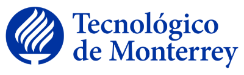

# TC3027 - Implementation of Computational Methods

## Course intentions
This intermediate computer technologies course focuses on competency development in the area of computer science. The main topics studied in this educational unit are: programming paradigms and automata theory. Prior knowledge is required of discrete mathematics and algorithm and data structure analysis, design and programming using a high-level language.

Learning outcome: Students design and implement programs that resolve diverse computer problems optimally through the application of the concepts of automata theory and using different programming paradigms.

## Course objective
Upon completion of this educational unit, students will be able to:
- Implement computer algorithms to solve problems.
- Optimize computer algorithms applied in the development of solutions.
- Generate computer models for solving problems.
- Implement computer models in the numerical solution of a problem.
